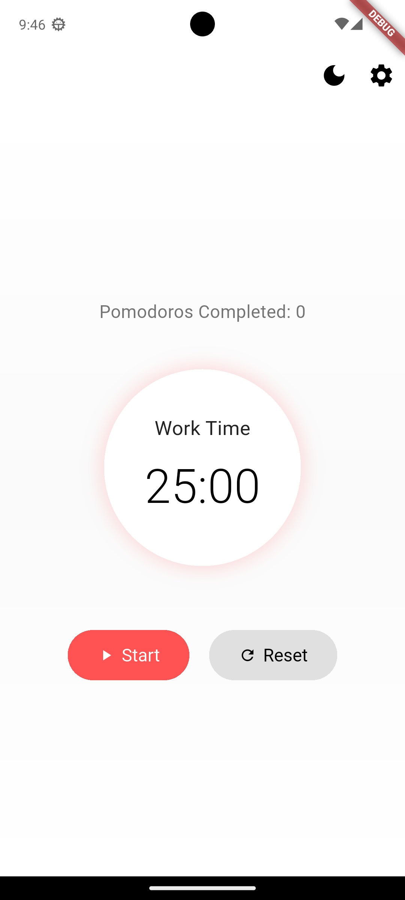
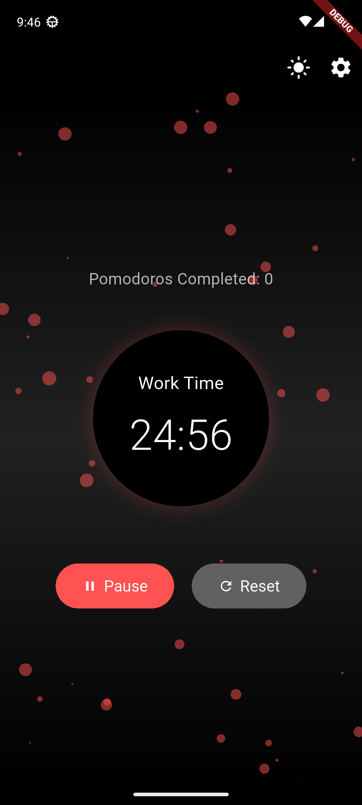
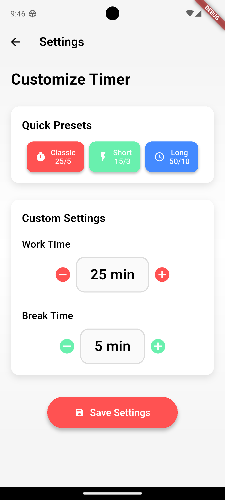
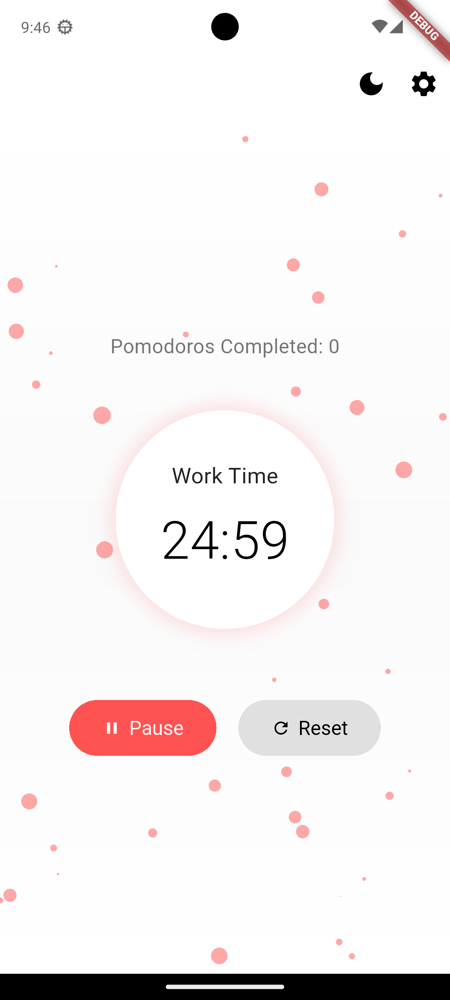

# 🍅 Pomodoro Timer App

Aplikasi timer Pomodoro modern dan minimalis yang dibangun dengan Flutter untuk membantu Anda tetap fokus dan produktif dalam bekerja.

## ✨ Fitur Utama

- ⏱️ **Timer Pomodoro Klasik**: Siklus 25 menit kerja + 5 menit istirahat
- 🎨 **Mode Gelap/Terang**: Beralih antara tema gelap dan terang
- ⚙️ **Pengaturan Kustom**: Sesuaikan waktu kerja dan istirahat sesuai kebutuhan
- 🎯 **Preset Cepat**: Pilih preset waktu yang sudah disiapkan (Klasik, Pendek, Panjang)
- ✨ **Efek Partikel**: Animasi partikel yang menarik saat timer berjalan
- 📊 **Pelacakan Produktivitas**: Hitung jumlah Pomodoro yang telah diselesaikan
- 💾 **Penyimpanan Otomatis**: Pengaturan tersimpan secara otomatis menggunakan SharedPreferences
- 📱 **UI Modern**: Desain antarmuka yang bersih dan responsif

## 📸 Screenshots

### Halaman Utama (Mode Terang)



### Halaman Utama (Mode Gelap)



### Halaman Pengaturan



### Timer Berjalan dengan Efek Partikel



## 🚀 Instalasi

### Persyaratan Sistem

- Flutter SDK ^3.9.0
- Dart SDK
- Android Studio / VS Code dengan ekstensi Flutter
- Perangkat Android/iOS atau emulator

### Langkah Instalasi

1. **Clone repository ini:**

   ```bash
   git clone https://github.com/username/pomodoro-timer.git
   cd pomodoro-timer
   ```

2. **Install dependencies:**

   ```bash
   flutter pub get
   ```

3. **Jalankan aplikasi:**
   ```bash
   flutter run
   ```

## 📱 Cara Penggunaan

### Memulai Timer

1. Buka aplikasi Pomodoro Timer
2. Klik tombol **"Start"** untuk memulai sesi kerja 25 menit
3. Saat timer mencapai 0, aplikasi akan otomatis beralih ke mode istirahat
4. Efek partikel akan muncul saat timer berjalan

### Mengubah Pengaturan

1. Klik ikon **⚙️** di pojok kanan atas
2. Pilih **"Quick Presets"** untuk preset cepat atau
3. Gunakan **"Custom Settings"** untuk mengatur waktu manual
4. Klik **"Save Settings"** untuk menyimpan perubahan

### Menggunakan Preset

- **Classic**: 25 menit kerja, 5 menit istirahat
- **Short**: 15 menit kerja, 3 menit istirahat
- **Long**: 50 menit kerja, 10 menit istirahat

### Mode Gelap/Terang

- Klik ikon matahari/bulan di pojok kanan atas untuk beralih tema

## 🏗️ Arsitektur Proyek

```
lib/
├── main.dart                    # Entry point aplikasi
├── home_screen.dart             # Halaman utama dengan timer
├── settings_screen.dart         # Halaman pengaturan
├── timer_provider.dart          # State management untuk timer
├── pomodoro_app_bar.dart        # App bar dengan kontrol tema
├── main_content.dart            # Konten utama halaman home
├── timer_display.dart           # Komponen tampilan timer
├── control_buttons.dart         # Tombol kontrol (Start/Pause/Reset)
├── particle_background.dart     # Efek partikel latar belakang
├── preset_buttons.dart          # Tombol preset waktu
├── stepper_section.dart         # Kontrol stepper untuk pengaturan
├── custom_settings_section.dart # Bagian pengaturan kustom
└── save_button.dart             # Tombol simpan pengaturan
```

## 📦 Dependencies

```yaml
dependencies:
  flutter:
    sdk: flutter
  provider: ^6.0.5 # State management
  particles_flutter: ^0.1.4 # Efek partikel
  shared_preferences: ^2.2.2 # Penyimpanan lokal
```

## 🔧 Teknologi yang Digunakan

- **Flutter**: Framework UI untuk pengembangan aplikasi multi-platform
- **Dart**: Bahasa pemrograman
- **Provider**: State management pattern
- **SharedPreferences**: Penyimpanan data lokal
- **Material Design**: Sistem desain Google

## 🎨 Fitur Desain

- **Minimalis**: Desain yang bersih tanpa elemen yang tidak perlu
- **Responsif**: Berfungsi dengan baik di berbagai ukuran layar
- **Aksesibilitas**: Kontras warna yang baik dan ukuran teks yang sesuai
- **Animasi**: Transisi yang halus dan efek visual yang menarik
- **Konsistensi**: Mengikuti prinsip desain Material Design

## 🤝 Kontribusi

Kontribusi sangat diterima! Silakan ikuti langkah berikut:

1. Fork repository ini
2. Buat branch fitur baru (`git checkout -b feature/AmazingFeature`)
3. Commit perubahan (`git commit -m 'Add some AmazingFeature'`)
4. Push ke branch (`git push origin feature/AmazingFeature`)
5. Buat Pull Request

## 📝 Lisensi

Proyek ini menggunakan lisensi MIT. Lihat file `LICENSE` untuk detail lebih lanjut.

## 👨‍💻 Pengembang

Dibuat dengan ❤️ menggunakan Flutter

---

**Catatan**: Untuk screenshot yang sebenarnya, silakan jalankan aplikasi dan ambil screenshot dari perangkat Anda, kemudian ganti placeholder gambar di folder `screenshots/`.

## 🔄 Pembaruan

### v1.0.0

- Fitur timer Pomodoro dasar
- Mode gelap/terang
- Pengaturan kustom
- Efek partikel
- Penyimpanan pengaturan otomatis
